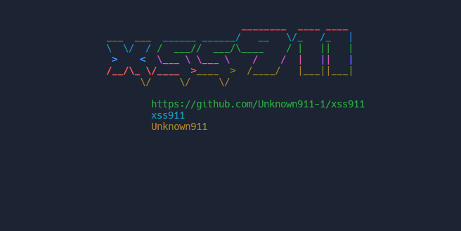
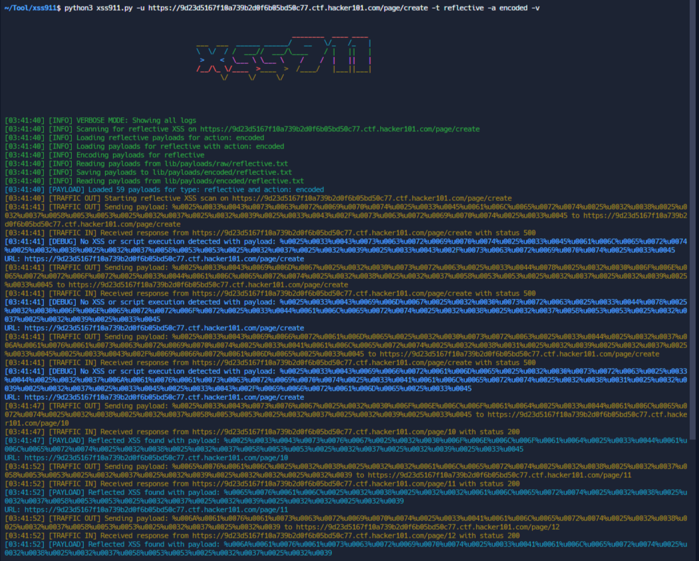

# XSS911 - Advanced XSS Vulnerability Scanner



XSS911 is a powerful and flexible XSS (Cross-Site Scripting) vulnerability scanner designed to identify and report various types of XSS vulnerabilities. The tool covers reflective, stored, DOM-based, and blind XSS attacks with advanced detection mechanisms and reporting features.

## Features

- **Reflective XSS**: Detects vulnerabilities where user input is immediately reflected in the response.
- **Stored XSS**: Identifies issues where user input is stored and later retrieved.
- **DOM-based XSS**: Analyzes client-side JavaScript manipulations that can lead to XSS.
- **Blind XSS**: Scans for XSS vulnerabilities that require out-of-band callbacks.
- **Custom Payloads**: Supports adding custom payloads for testing.
- **Verbose Logging**: Detailed logs with color-coded outputs for better analysis.
- **Blind XSS Server**: Hosts a server to test for blind XSS payloads.
- **URL Redirection Detection**: Checks whether a given URL redirects and logs the result.
- **Limit Vulnerabilities**: Control how many vulnerabilities are displayed.

## Installation

1. Clone the repository:
   ```bash
   git clone https://github.com/Unknown911-1/xss911.git
   cd xss911
   ```

2. Install the required packages:
   ```bash
   pip install -r requirements.txt
   ```

### Usage
To run the scanner, use the following command:
```
python xss911.py -u <URL> -t <TYPE> -a <ACTION> [-ad <CUSTOM_PAYLOADS>] [-v] [-b <BLIND_PAYLOAD_URL>]
```

### Arguments

- `-u`, `--url`: The URL to scan for XSS vulnerabilities. Accepts a file containing URLs or a single URL.
- `-t`, `--type`: Type of XSS to scan for (`reflective`, `stored`, `blind`, `dom`).
- `-a`, `--action`: Payload action type (`raw` or `encoded`). Default is `raw`.
- `-ad`, `--add-payloads`: Path to a file with custom payloads.
- `-v`, `--verbose`: Enable verbose mode for detailed logging.
- `-b`, `--blind_payload_url`: URL to check for blind XSS payloads (should end with `.js` or `?data=`).
- `-l`, `--limit`: Set the maximum number of vulnerabilities to display (default is 5).
- `--blind`: Host a webserver for testing blind XSS payloads.
- `--login`: Login To the target Website to visit the target page.

### Example

To scan a URL for reflective XSS vulnerabilities with encoded payloads:
```bash
python xss911.py -u https://example.com -t reflective -a encoded
```

To add custom payloads and enable verbose logging:
```bash
python xss911.py -u path/to/urls.txt -t blind -ad path/to/custom_payloads.json -v
```

To start a blind XSS server and scan a URL:
```bash
python xss911.py -u https://example.com -t blind --blind
```

### Blind XSS Testing

To test for blind XSS attacks, you can host a webserver using the `--blind` flag. This server will capture payloads injected into out-of-band systems.

```bash
python xss911.py --blind
```

### Custom Payloads

You can add custom payloads to the scanner by providing a file with payloads:

```bash
python xss911.py -ad /path/to/custom_payloads.json -t <TYPE>
```

### URL Redirection Detection

The tool can detect if a URL is redirected before processing it for XSS vulnerabilities:

```bash
python xss911.py -u <URL> --login
```

### Testing

To run unit tests for the different modules, use:
```bash
python -m unittest discover -s xss911/tests
```

## Screenshots



## Contributing

Feel free to contribute to the project by submitting issues, pull requests, or suggestions. For any contributions, please adhere to the project's coding standards and guidelines.

## License

This project is licensed under the MIT License - see the [LICENSE](./LICENSE) file for details.

## Contact

For any inquiries or support, please reach out to [honestlady1gg@gmail.com](mailto:honestlady1gg@gmail.com).

## Support This Project

If you find this script useful and would like to support further development, consider donating using cryptocurrency!

### Bitcoin
Address: `32VaadWB1EkD18hoE8t5pGqRmyD5g4CV9A`

[](https://github.com/user-attachments/assets/83bbedff-f793-4797-9a50-391ab8a2a838)

### Ethereum
Address: `0x673ffaA78F49CF7f3627178EDaf512F58160e3ED`

[](https://github.com/user-attachments/assets/e537afb6-cc0f-4ef6-9beb-0a9002a32014)

### USDT (TRC-20)
Address: `TMcVnY3CyqEfgqCwhunzGjJdwsR4WSZZc9`

[](https://github.com/user-attachments/assets/d4666b3a-bbca-42d5-85c0-df4e21b96203)

